# GNSS aided IMU

Here we study an inertial navigation system (INS) constructed using sensor fusion by a Kalman filter. The code provides a working system with an inertial measurement unit (IMU, here accelerometer+gyro) and GNSS (GPS). The folloing things are evaluated:
* The effects of GPS signal outage on the navigation solution
* An improved vehicle motion model (”car does not skid or fly”)
* Measurements from a speedometer to the navigation fusion filter.
and study the improved performance during GPS signal outage.

### 1. GNSS-receiver outage simulation at 200s

#### Position and speed profile
<table><tr>
<td> 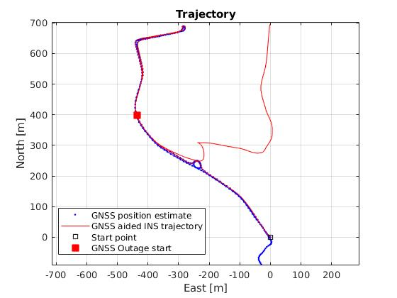 </td>
<td> 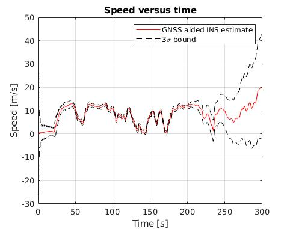 </td>
</tr></table>

#### Position error

<table><tr>
<td> 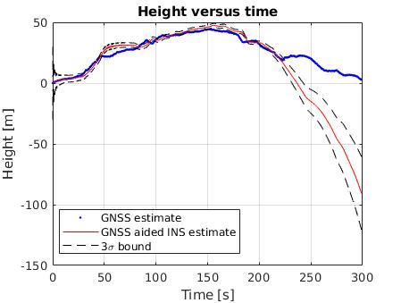 </td>
<td> 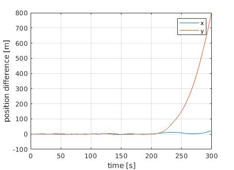 </td>
</tr></table>

### 2. GNSS-receiver outage simulation with non-holonomic constraints (Position RMS error = 9.7721)

#### Position and speed profile
<table><tr>
<td> 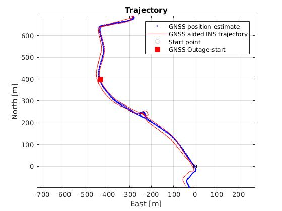 </td>
<td> 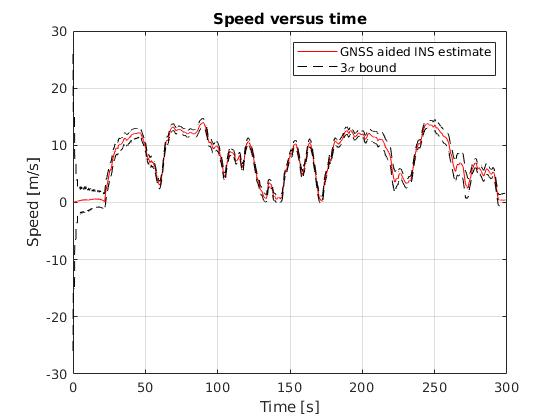 </td>
</tr></table>

#### Position error

<table><tr>
<td> 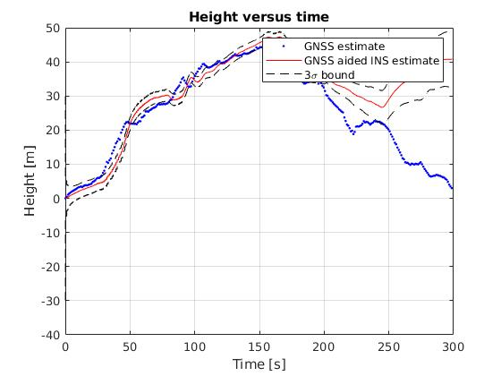 </td>
<td> 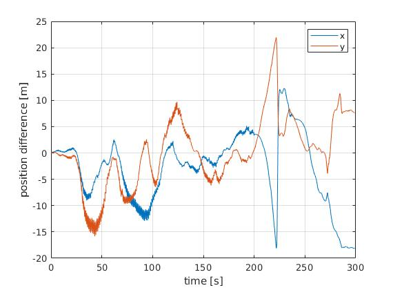 </td>
</tr></table>

### 3. GNSS-receiver outage simulation with non-holonomic constraints and speed-aiding (Position RMS error = 10.0474)

#### Position and speed profile
<table><tr>
<td> 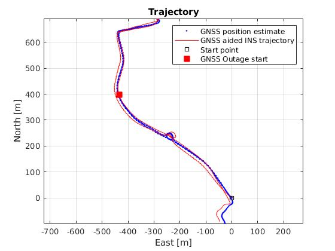 </td>
<td> 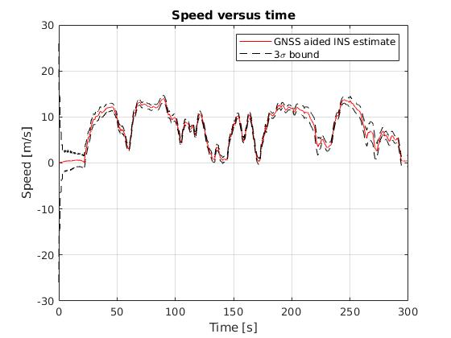 </td>
</tr></table>

#### Position error

<table><tr>
<td> 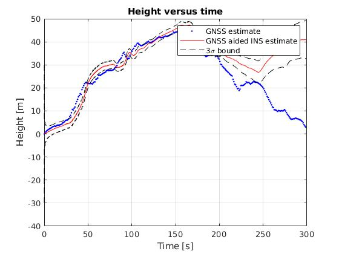 </td>
<td> 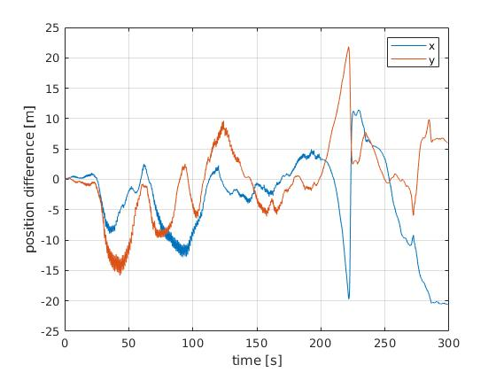 </td>
</tr></table>
